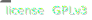
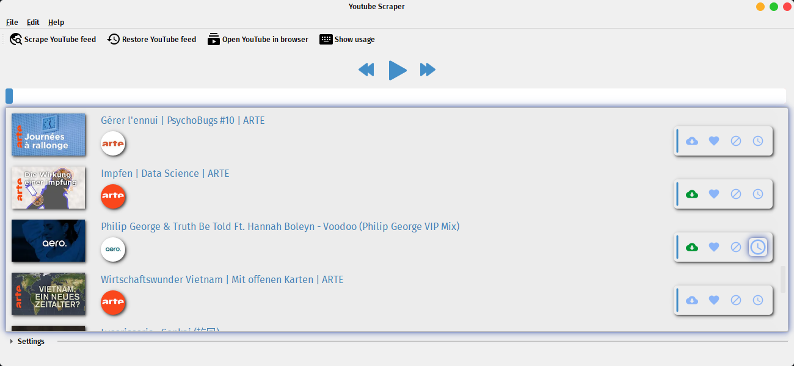
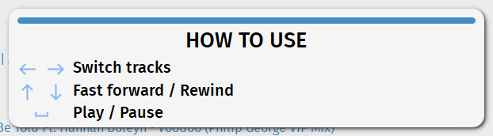

# Youtube-Feed-Scraper

# UNDER DEV

   
  
   

#### Table of contents  <!-- omit in toc -->
- [Youtube-Feed-Scraper](#youtube-feed-scraper)
- [UNDER DEV](#under-dev)
- [Youtube Feed Scraper](#youtube-feed-scraper-1)
  - [Development](#development)
      - [Requirements](#requirements)
  - [Features](#features)
  - [WIPs](#wips)

# Youtube Feed Scraper
The main motivation is that, among other tools, I often use Youtube to find new music that pops up in my subscriptions page. When I want to focus on this task, having a huge amount of tabs opened and waiting for them to load is not ideal when I simply want to skim through all songs. Tracking them is also difficult, since I access my Youtube feed for this purpose rather sporadically. With ``Youtube Feed Scraper``, it will be possible to never miss new music and listen to all of it faster than ever.

## Development

#### Requirements

📝 `Python +3.8`  
📝 `pip3`  
📝 `PyQt5` (for full PyInstaller support)  
📝 `pipenv` (recommended)  
📝 Packages inside `pipfile`. They will be installed in the virtual environment with `pipenv install`.

To get started:

1. Clone the repo: `git clone https://github.com/danicc097/Youtube-Feed-Scraper.git`
2. Create a virtual environment for the project with `pipenv shell`
2. Install the required packages and corresponding versions with `pipenv install`
3. Run the main program file with `pipenv run python main.py`
4. To distribute using `PyInstaller`, the project can easily be built with `build-windows.ps1` or `build-linux.sh`.

## Features

TBD

## WIPs

☑️ Include WIPs \
⬜ Integrated browser \
⬜ Youtube API

---
[GPLv3 Licensed](https://www.gnu.org/licenses/gpl-3.0.en.html) ([LICENSE](https://github.com/danicc097/Youtube-Feed-Scraper/LICENSE)). © [Daniel Castro](https://github.com/danicc097), 2021.
